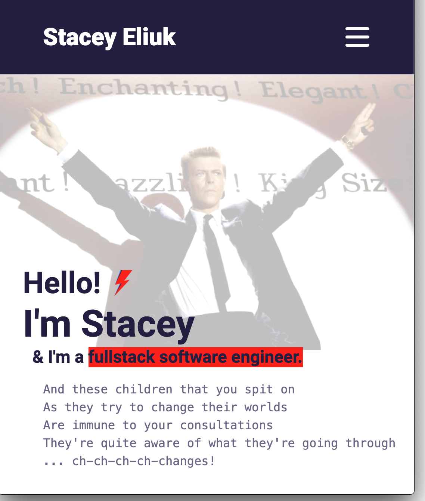

# Stacey Eliuk | Software Engineer

#### A portfolio of changes



---

## Sections

1. About me
2. Proficiencies & Skills
3. Projects
4. Contact me

---

## How to Start

1. **Install the Gatsby CLI.**

   ```
   npm install -g gatsby-cli

   ```

2. **Create a new Gatsby site with this repo.**

   ```
   gatsby new portfolio-minimal https://github.com/hotpinkpoliticalmatrix/se-portfolio
   ```

3. **Start the site in `develop` mode.**

   ```
   cd portfolio-minimal
   gatsby develop
   ```

4. **Open the source code and start editing!**

---

I always appreciate feedback, so share your thoughts and suggestions with me: [seliukfsa@gmail.com](mailto:seliukfsa@gmail.com)

This portfolio was branched off [Konstantin Muenster's](https://www.konstantin.digital/) excellent gatsby starter site portfolio. If you want to use it yourself, check out the repo on github [here](https://github.com/konstantinmuenster/gatsby-starter-portfolio-minimal)!

If you find any bugs, create a new issue or pull request 🙏

Thanks a lot for viewing!
